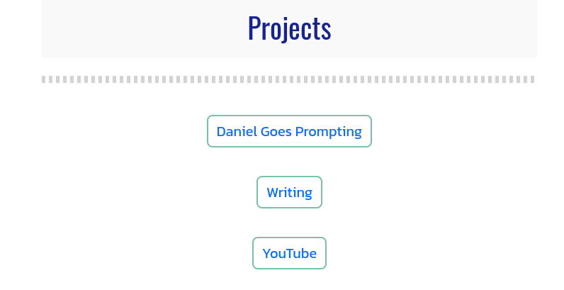

# Prompt

Here's how buttons are laid out on my website. I think they would look better in rows (perhaps two per row) and with a handwriting style font for the project name. Could you provide the CSS for this?

# Context File(s)

[END]